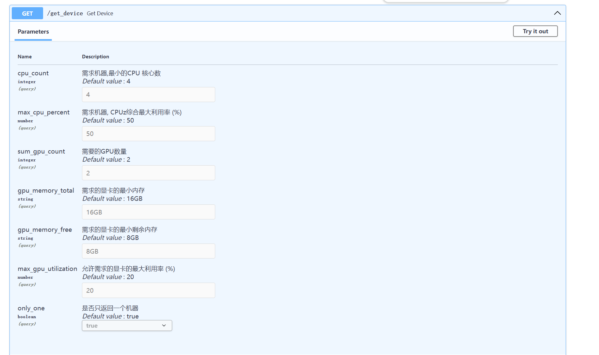

# nv-better

> 快速从集群中收集和寻找最优CPU和GPU节点

> !注意：这并非一个成熟的项目，你可以使用它，但是需要慎重


**源码运行**

> 首先创建一个虚拟环境(推荐Python版本>=3.10)，然后安装依赖

```shell
python -m venv venv
source venv/bin/activate
pip install -r req.txt
```

Server

```shell
# 也可通过环境变量设置 KEY 
# export KEY=xxxxx
python server.py

# 打开 http://localhost:12999/docs 查看API文档
```

Client

```shell
# 也可通过环境变量设置 KEY 和 SERVER
# export KEY=xxxxx  # 与Server的KEY一致
# export SERVER=http://localhost:12999
python client.py 
```

**Docker运行**

依赖于[Nvidia-container-toolkit ](https://docs.nvidia.com/datacenter/cloud-native/container-toolkit/latest/install-guide.html)

```
docker pull ghcr.io/xx025/nv-better:latest
```

具体参考 [DockerCompose.yaml](DockerCompose.yaml)

**API**




